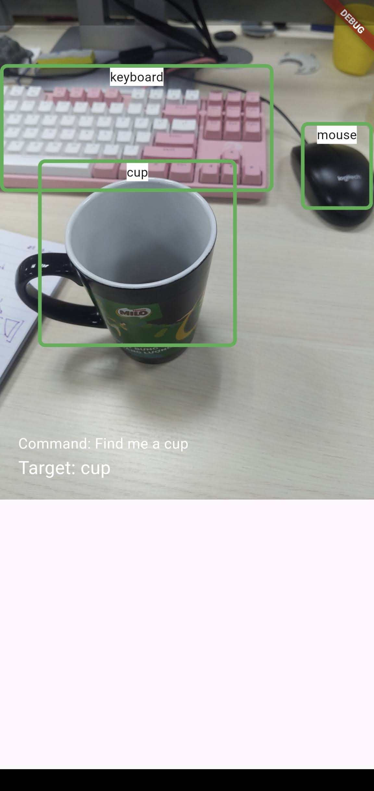

<<<<<<< HEAD
# Object_Detection_android
=======
# Flutter Realtime Object Detection and Navigation

A mobile app that:
- Detects common objects in realtime via rear camera smartphone
- Extract queried object (target) from voice command input
- Confirm target by Google/Siri voice
- Vibrates if target is found, which help target navigating

## Developer: 
[SauronVan]

## Credit
Implemented from https://github.com/ultralytics/yolo-flutter-app by https://github.com/asabri97

## Note
- JDK 17
- Graddle > 8.3
- Android SDK ~35

## Demo

## Getting Started

This project is a starting point for a Flutter application.
